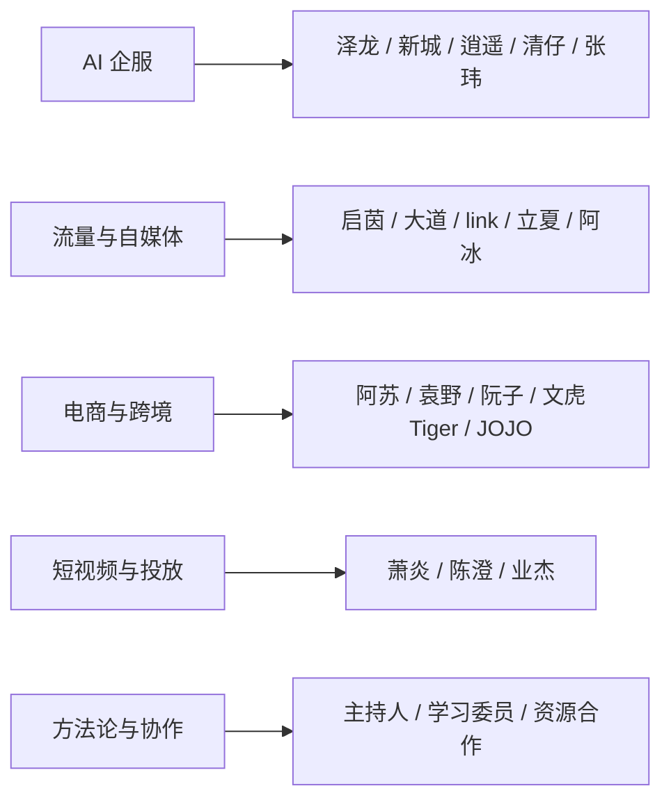

# 项目地图

> 这一页把成员按赛道、阶段、卡点和下一步放到同一张地图里。它回答的问题是：谁在做什么，卡在哪里，应该先做什么。

## 成员矩阵

| 成员 | 赛道 | 阶段 | 核心卡点 | 下一步 |
|------|------|------|----------|--------|
| [[host|主持人]] | 会议方法论 | 组织者 | 帮助创业者把模糊表达拉回客户、需求和成交现场 | 用 30 秒介绍和“谁会付钱”检验每个项目 |
| [[zelong|泽龙]] | AI企服/跨境 | 转型验证 | 原有跨境资源尚未转成 AI 企服产品入口 | 给原有电商客户发布 AI 企服服务菜单，拿 3 个样板客户 |
| [[qiyin|启茵]] | 自媒体/IP | MVP | 香港 IP 容易自嗨，真实港漂刚需和私域承接未跑通 | 先不做小程序，连续测试租房、换汇、开户、求职等 30 条内容 |
| [[xincheng|新城]] | AI企服/培训 | 获客验证 | 代做和工具产品之间摇摆，企培成交物料不足 | 做企业提效演示包和五件套，去产业带地推 |
| [[xiaoyao|逍遥]] | AI企服/案例库 | 产品化 | 案例展示和变现路径不够产品化 | 做手机端行业案例库，用安卓和苹果测试可读性 |
| [[wenhu-tiger|文虎Tiger （文虎）]] | 出海网站/内容 | 轻量试错 | 视频制作效率和 APP 维护方向容易过重 | 拆 20 个英语学习爆款分镜，用网站 SEO 和广告轻量验证 |
| [[qingzai|清仔]] | AI企服/跨境 | 定价放大 | 已成交但定价和长期 MSP 路径不清晰 | 把已成交项目包装成案例，设计三档报价 |
| [[linyi|林奕]] | 职业培训/AI | 渠道验证 | PPT、微软服务、职业培训、工具产品多方向分散 | 优先调研 AI 职业培训证书和地方渠道分润 |
| [[lixia-victoria|立夏（Victoria）]] | 大健康/私域 | 流量再增长 | 私域已有一波，缺新流量和团长渠道 | 成长号和营养号并行，招募宝妈团长和读书群主 |
| [[dadao|大道]] | AI自媒体 | 冷启动 | 平台选择和变现路径不清 | 一个主题拆成 10 种形态分发，先到 5000 粉 |
| [[link|link]] | AI应用/自媒体 | 公开记录 | 产品数据不好时不敢公开，产品和内容割裂 | 用创业实验室定位公开 5 个产品过程和数据 |
| [[qingtian|晴天]] | 流量/AI代做 | 选赛道 | 会打流量但后端业务未锁定 | 上架 5 个 AI 代做服务，闲鱼/小红书/本地群测试 |
| [[asu-bacong|阿苏（巴聪）]] | 跨境电商 | 组织升级 | 成熟业务、AI 学习、选品和团队建设分散精力 | 固定面试节奏，建立异常爆品 AI 选品 SOP |
| [[zhangwei-david|张玮（David）]] | 工厂出海/企服 | 标杆客户 | 老板担心效果，交付路径长 | 不承诺增长，做行业案例 iPad 展示包和内容交付报价 |
| [[abing|阿冰]] | 自媒体/快钱 | 现金流修复 | 自媒体不敢变现，长期没正反馈 | 先做可控快钱，同时推出个人使用说明书 H5 样板 |
| [[yuanye|袁野]] | 电商供应链 | 规模延展 | 纸巾电商利润低，担心项目周期 | 用 8000 万业绩背书做平台 BD 和出海小组 |
| [[chenxi-cenxi|晨曦（岑奚）]] | 虚拟产品 | 换品验证 | 测试粉流量价值和客户价值偏低 | 两天全平台找 10 个高价值模板，开两个号测试 |
| [[ruanzi-ruandafan|阮子（阮大范）]] | 小红书电商/POD | 爆品验证 | 标签混乱，POD 周期过长 | 先多账号做小红书百货卖货，爆文后再考虑 POD |
| [[xiaoyan|萧炎]] | 油管/视频号 | SOP搭建 | 内容做不过来，招人与标准化犹豫 | 用 6000 元预算做 10 天日结助理试岗 |
| [[jojo|JOJO]] | 跨境重启 | 从零掌控 | 财务代账不适合，跨境全托缺主动权 | 注册平台账号并自己跑第一批小单 |
| [[chencheng|陈澄]] | 短视频/CPS | 产品闭环 | 有内容能力但缺后端产品，长视频反馈慢 | 选一个能承接流量的 CPS 或本地服务产品 |
| [[yejie|业杰]] | 投放/视频号 | 红利测试 | 知识付费消耗，学员投不出结果 | 测试视频号深夜投放和真人口播素材 |
| [[fei|菲]] | AI出海网站 | 流量优先 | 产品先行但半年没有流量结果 | 70% 精力做关键词、竞品、收录和外链 |
| [[sheriff-learning-committee|学习委员警长分享]] | 社群角色 | 资源链接 | 多数人低估社群角色带来的项目信息密度 | 承担社群服务角色，增加深聊与项目样本 |
| [[collaboration-faq|资源合作答疑]] | 资源合作 | 信任验证 | 初识就拆前后端容易稀释核心资源 | 先用小单、牵线提成和转介绍验证协作 |
