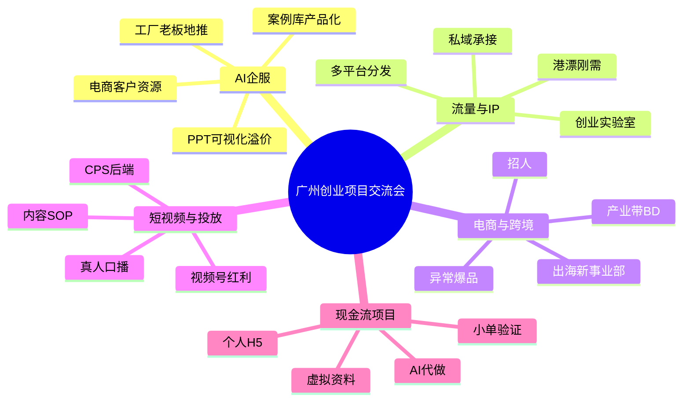

# 赛道矩阵

> 赛道矩阵不是为了分类好看，而是为了看清：哪些人可以共享打法，哪些人需要换路径。

## 赛道分布

| 赛道 | 人数 |
|------|------|
| AI企服/跨境 | 2 |
| 会议方法论 | 1 |
| 自媒体/IP | 1 |
| AI企服/培训 | 1 |
| AI企服/案例库 | 1 |
| 出海网站/内容 | 1 |
| 职业培训/AI | 1 |
| 大健康/私域 | 1 |
| AI自媒体 | 1 |
| AI应用/自媒体 | 1 |
| 流量/AI代做 | 1 |
| 跨境电商 | 1 |
| 工厂出海/企服 | 1 |
| 自媒体/快钱 | 1 |
| 电商供应链 | 1 |
| 虚拟产品 | 1 |
| 小红书电商/POD | 1 |
| 油管/视频号 | 1 |
| 跨境重启 | 1 |
| 短视频/CPS | 1 |
| 投放/视频号 | 1 |
| AI出海网站 | 1 |
| 社群角色 | 1 |
| 资源合作 | 1 |

## 五条主线

